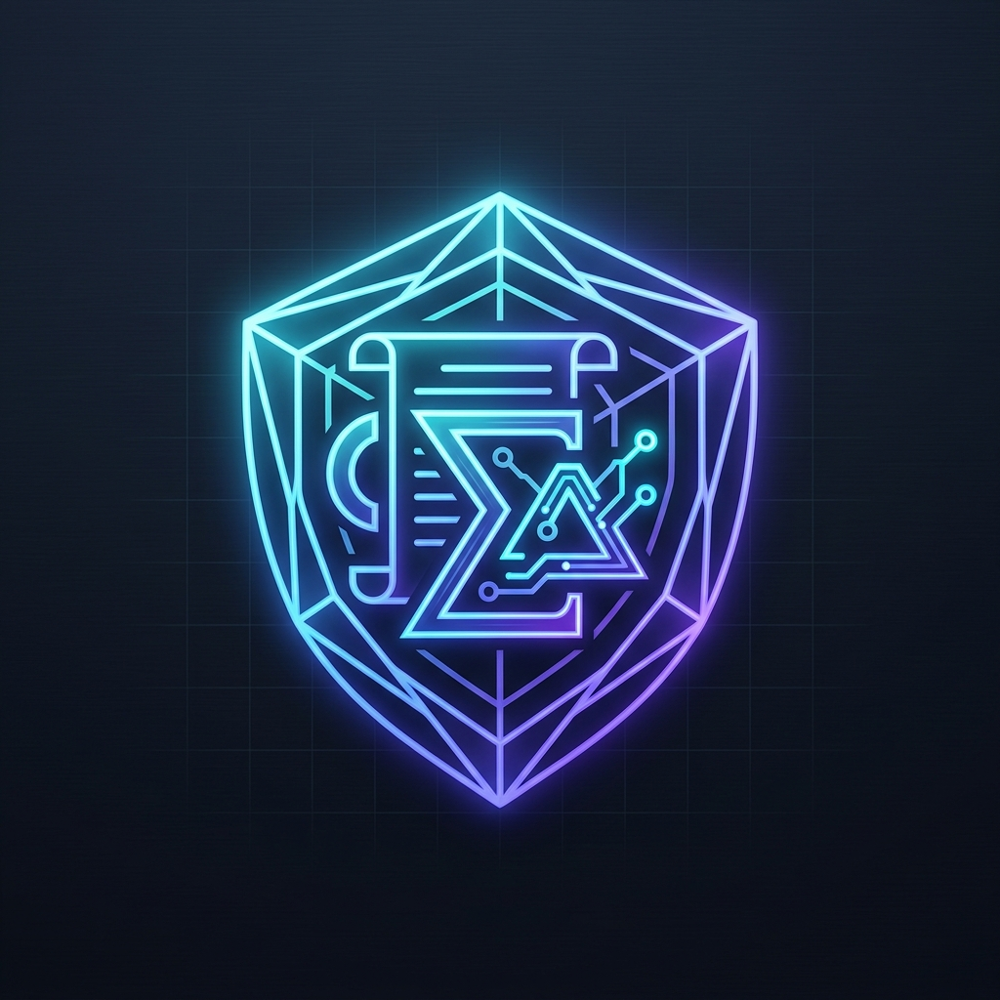
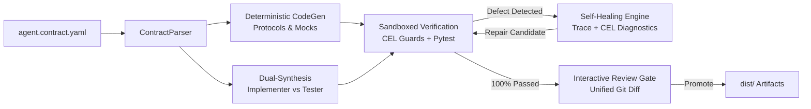

<p align="center">
  
</p>

<h1 align="center">ContractAgent</h1>

<p align="center">
  <strong>Spec-Driven Behavioral Contract & Verification Compiler for Tool-Using AI Agents</strong>
</p>

<p align="center">
  <a href="https://github.com/stefanosello/contract-agent/actions"></a>
  <a href="#"></a>
  <a href="https://www.python.org/downloads/"></a>
  <a href="#"></a>
  <a href="https://github.com/astral-sh/ruff"></a>
  <a href="#"></a>
  <a href=".specify/memory/constitution.md"></a>
  <a href="LICENSE"></a>
</p>

---

## ⚡ Overview

**ContractAgent** brings formal **Spec-as-Source** engineering discipline to autonomous AI agents. Behavioral invariants, tool schemas, and multi-turn workflows are defined in declarative specifications (`agent.contract.yaml`) and enforced deterministically at runtime via Google Common Expression Language (CEL).

The **Dual-Synthesis Compiler** uses decoupled LLM personas to synthesize typed Python agent implementations and adversarial test suites, continually verifying and repairing candidates in an isolated self-healing sandbox before gated promotion.



---

## 🛡️ Key Capabilities

- **Spec-as-Source**: Declarative behavioral contract is the sole immutable source of truth; code is a reproducible build artifact.
- **Zero-LLM Invariant Enforcement**: Evaluated deterministically with memory-bounded, non-Turing complete Google CEL rules.
- **Strict Protocol Binding**: Generates typed `Protocol` interfaces (`dist/interface.py`) and synthetic mocks (`dist/mocks.py`). Human backend handlers in `services/` are never overwritten.
- **Decoupled Dual-Synthesis**: `AgentImplementer` and `AdversarialTester` personas operate independently to prevent correlated blindspots.
- **Autonomous Self-Healing**: Captures execution tracebacks and CEL violation payloads, iteratively repairing candidate logic within 3 retries.
- **Human Review Gate**: Interactive unified Git diff requires developer approval before promotion; supports `--headless-ci` for CI automation.
- **Budget Discipline**: Built-in token accounting and cost tracking guarantee compilation remains strictly under **$0.05** per verified agent.

---

## 🚀 Quickstart

### Prerequisites

- Python 3.11+
- [uv](https://docs.astral.sh/uv/) package manager

### 1. Installation

```bash
git clone https://github.com/stefanosello/contract-agent.git
cd contract-agent
uv sync
```

### 2. Compile an Agent Contract

Compile interactively with unified Git diff review:

```bash
uv run contract-agent compile tests/fixtures/benchmarks/01_billing_dispute.contract.yaml
```

Run in headless CI mode with zero-network mock provider:

```bash
uv run contract-agent compile tests/fixtures/benchmarks/01_billing_dispute.contract.yaml \
  --output-dir dist \
  --provider mock \
  --headless-ci
```

Compile with live budget-efficient backends:

```bash
# DeepSeek-V3
export DEEPSEEK_API_KEY="your-api-key"
uv run contract-agent compile agent.contract.yaml --provider deepseek-v3

# Gemini Flash
export GEMINI_API_KEY="your-api-key"
uv run contract-agent compile agent.contract.yaml --provider gemini-flash
```

---

## 📝 Example Contract Specification

```yaml
spec_version: "0.3"
metadata:
  name: "billing_dispute_agent"
  version: "1.0.0"
invariants:
  - id: "INV-001"
    target: "tool:execute_refund"
    description: "Refund amount cannot exceed $100 without manager approval"
    rule: "args.amount <= 100.0"
    on_violation: "require_escalation"
  - id: "INV-002"
    target: "session:call_sequence"
    description: "fetch_invoice must be called before execute_refund"
    rule: "called_before('fetch_invoice', 'execute_refund')"
    on_violation: "block_tool_call"
tools:
  - name: "fetch_invoice"
    description: "Fetches invoice details by invoice ID"
    parameters:
      type: "object"
      required: ["invoice_id"]
      properties:
        invoice_id: { type: "string" }
  - name: "execute_refund"
    description: "Executes customer refund against invoice"
    parameters:
      type: "object"
      required: ["invoice_id", "amount", "reason"]
      properties:
        invoice_id: { type: "string" }
        amount: { type: "number" }
        reason: { type: "string" }
```

---

## 🧪 Testing & Verification

```bash
# Run full test suite (67 unit, property, and integration tests)
uv run pytest

# Mathematical boundary fuzzing & mutation trapping
uv run pytest tests/property/ tests/mutation/

# Static type check (0 errors enforced)
uv run pyrefly check

# Code formatting & lint check
uv run ruff check src tests
```

---

## 🏛️ Governance

Development is strictly governed by the [ContractAgent Constitution](.specify/memory/constitution.md) with deterministic Git pre-commit hooks enforcing:
- Maximum 200 LOC per commit
- Maximum 10 files per commit
- Protected `main` branch with mandatory Pull Request protocol
