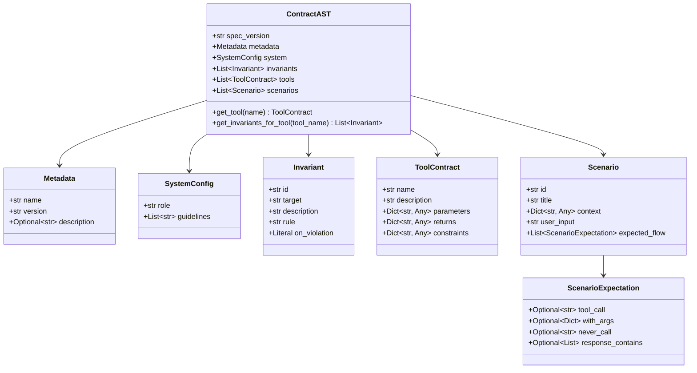
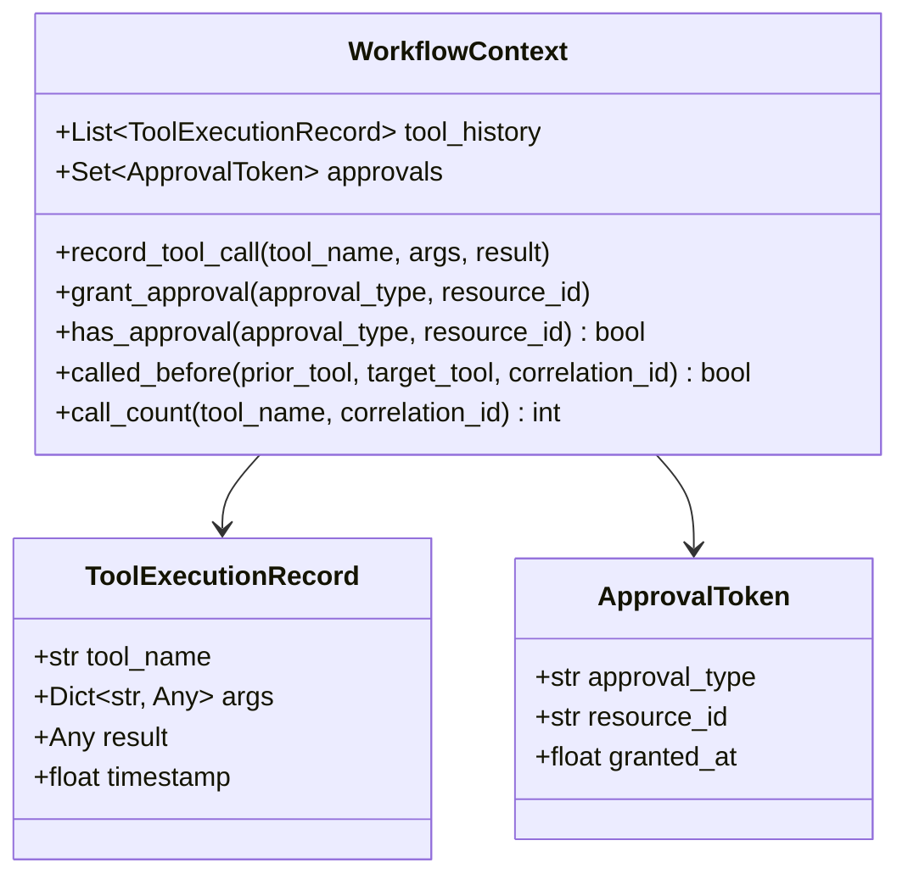

# Data Model: ContractAgent Core Engine & AST Parser

**Branch**: `001-core-engine` | **Date**: 2026-09-23

This document defines the entity schemas, relationships, state models, and validation rules for the ContractAgent Core Engine.

---

## 1. Abstract Syntax Tree (AST) Entities



### Entity Definitions

#### `ContractAST`
- **Fields**:
  - `spec_version`: `str` (default `"0.3"`)
  - `metadata`: `Metadata` (required)
  - `system`: `Optional[SystemConfig]`
  - `invariants`: `List[Invariant]` (default `[]`)
  - `tools`: `List[ToolContract]` (default `[]`)
  - `scenarios`: `List[Scenario]` (default `[]`)
- **Validation**:
  - Validates uniqueness of `Invariant.id` across all invariants.
  - Validates uniqueness of `Scenario.id` across all scenarios.
  - Validates referential integrity: any `tool:<name>` target in invariants must match a defined tool in `tools`.
  - Validates that scenario `tool_call` and `never_call` reference valid defined tools.

#### `Invariant`
- **Fields**:
  - `id`: `str` (non-empty string, e.g., `"INV-001"`)
  - `target`: `str` (scope target, e.g. `"tool:execute_refund"`, `"*"`, `"session:call_sequence"`)
  - `description`: `str` (human-readable explanation)
  - `rule`: `str` (CEL boolean expression)
  - `on_violation`: `Literal["raise_invariant_violation", "block_tool_call", "require_escalation"]` (default `"raise_invariant_violation"`)

#### `ToolContract`
- **Fields**:
  - `name`: `str` (valid Python identifier)
  - `description`: `str` (documentation string)
  - `parameters`: `Dict[str, Any]` (JSON Schema object for inputs)
  - `returns`: `Dict[str, Any]` (JSON Schema object for returns)
  - `constraints`: `Dict[str, Any]` (static metadata / limits)

---

## 2. Runtime Context & State Model



### Context Entities

#### `WorkflowContext`
- **State Fields**:
  - `tool_history`: `List[ToolExecutionRecord]` — Chronological record of executed tool calls.
  - `approvals`: `Set[ApprovalToken]` — Set of granted approval tokens keyed by `(approval_type, resource_id)`.
- **CEL Helper Methods**:
  - `has_approval(type: str, resource_id: str) -> bool`: Checks if matching `ApprovalToken` is present.
  - `called_before(prior: str, target: str, correlation_id: str = "") -> bool`:
    - If `correlation_id` is empty: returns `True` if `prior` appears before `target` in history (or prior was called and target has not yet executed).
    - If `correlation_id` is non-empty: returns `True` if `prior` was invoked with argument matching `correlation_id`.
  - `call_count(tool_name: str, correlation_id: str = "") -> int`: Returns number of times `tool_name` was executed (optionally filtered by `correlation_id` in arguments).

---

## 3. Exception & Error Hierarchy

```text
ContractAgentError (Base Exception)
├── ContractValidationError (Raised during static AST & CEL loading)
│   └── details: Dict[str, Any]
├── InvariantViolationError (Raised on fail-closed invariant breach)
│   ├── invariant_id: str
│   ├── rule: str
│   ├── target: str
│   └── context: Dict[str, Any]
├── EscalationRequiredError (Raised when invariant triggers human approval)
│   ├── approval_type: str
│   ├── resource_id: str
│   └── prompt: str
└── CELEvaluationError (Raised on internal CEL runtime execution fault)
```
