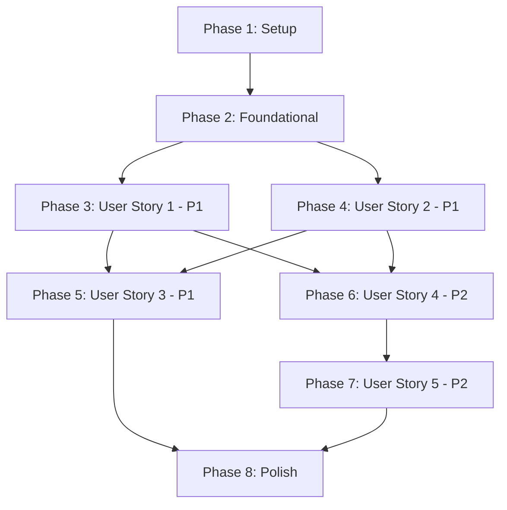

# Tasks: ContractAgent Core CEL Invariant Engine & AST Parser

**Branch**: `001-core-engine` | **Spec**: [specs/001-core-engine/spec.md](file:///Users/stefano/Documents/contract-agent/specs/001-core-engine/spec.md) | **Plan**: [specs/001-core-engine/plan.md](file:///Users/stefano/Documents/contract-agent/specs/001-core-engine/plan.md)

**Input**: Feature specification, design artifacts, and component contracts from `/specs/001-core-engine/`.

---

## Phase 1: Setup (Shared Infrastructure)

**Purpose**: Python project packaging, type-checking configuration, and package namespace initialization.

- [x] T001 Verify Python 3.11+ environment and dependencies (`cel-python`, `pydantic`, `pyyaml`, `hypothesis`, `pytest`, `pytest-asyncio`) in `pyproject.toml`
- [x] T002 [P] Configure strict typing and linting checks in `pyproject.toml` and `pytest.ini`
- [x] T003 [P] Setup core and runtime module namespace exports in `src/contract_agent/__init__.py` and `src/contract_agent/core/__init__.py`

---

## Phase 2: Foundational (Blocking Prerequisites)

**Purpose**: Core exception hierarchy and durable workflow context that all user stories depend on.

**⚠️ CRITICAL**: Must complete before user story implementation begins.

- [x] T004 Implement comprehensive exception hierarchy (`ContractAgentError`, `ContractValidationError`, `InvariantViolationError`, `EscalationRequiredError`, `CELEvaluationError`) in `src/contract_agent/core/exceptions.py`
- [x] T005 [P] Implement `WorkflowContext` tracking execution history (`ToolExecutionRecord`) and approval tokens (`ApprovalToken`) in `src/contract_agent/runtime/context.py`
- [x] T006 [P] Implement CEL environment and compiler wrapper with custom function activation in `src/contract_agent/runtime/cel_engine.py`

**Checkpoint**: Foundation ready — user story implementation can proceed in parallel.

---

## Phase 3: User Story 1 - Declarative Contract Parsing & Validation (Priority: P1) 🎯 MVP

**Goal**: Parse and validate `agent.contract.yaml` into strongly typed Pydantic models with parse-time CEL syntax and parameter schema validation.

**Independent Test**: Load valid and invalid contract YAML files via `ContractParser.from_file()` and assert valid specs return `ContractAST` while invalid ones raise `ContractValidationError`.

### Tests for User Story 1
- [x] T007 [P] [US1] Create contract parser unit test suite in `tests/unit/test_ast_parser.py` testing valid YAML, malformed YAML, and invalid CEL parameter bindings

### Implementation for User Story 1
- [x] T008 [P] [US1] Define typed Pydantic V2 AST models (`Metadata`, `SystemConfig`, `Invariant`, `ToolContract`, `Scenario`, `ScenarioExpectation`, `ContractAST`) with strict validation in `src/contract_agent/core/ast.py`
- [x] T009 [US1] Implement `ContractParser.from_file`, `from_dict`, and static CEL rule and parameter schema checks in `src/contract_agent/core/parser.py`
- [x] T010 [US1] Implement referential integrity checks (tools, invariants, scenarios) in `src/contract_agent/core/parser.py`

**Checkpoint**: User Story 1 complete and independently testable via `uv run pytest tests/unit/test_ast_parser.py`.

---

## Phase 4: User Story 2 - Deterministic CEL Invariant Evaluation (Priority: P1)

**Goal**: Compile and evaluate invariant rules deterministically in linear time with custom overloaded workflow functions.

**Independent Test**: Compile CEL rules and evaluate against mock `args` and `WorkflowContext`, asserting correct boolean resolution across boundaries.

### Tests for User Story 2
- [x] T011 [P] [US2] Create CEL engine unit test suite in `tests/unit/test_cel_engine.py` testing arithmetic boundaries, logical operators, and custom functions

### Implementation for User Story 2
- [x] T012 [P] [US2] Implement overloaded custom functions (`workflow.has_approval`, `workflow.called_before`, `workflow.call_count`) supporting both global and resource-correlated overloads in `src/contract_agent/runtime/cel_engine.py`
- [x] T013 [US2] Implement `CELEngine.evaluate_invariant` and fail-closed error handling in `src/contract_agent/runtime/cel_engine.py`

**Checkpoint**: User Story 2 complete and independently testable via `uv run pytest tests/unit/test_cel_engine.py`.

---

## Phase 5: User Story 3 - Zero-LLM Property-Based Fuzzing with Hypothesis (Priority: P1)

**Goal**: Automatically generate boundary-value property tests for CEL rules from tool parameter schemas with custom override support.

**Independent Test**: Run `pytest tests/property/test_cel_fuzzing.py` verifying 500+ iterations execute in <2s and correctly partition valid/invalid inputs.

### Tests for User Story 3
- [x] T014 [P] [US3] Create property-based fuzzing test suite in `tests/property/test_cel_fuzzing.py` testing numeric boundaries and string invariants

### Implementation for User Story 3
- [x] T015 [US3] Implement `InvariantFuzzer` in `src/contract_agent/testing/fuzzing.py` synthesizing Hypothesis search strategies from `ToolContract.parameters` JSON Schema
- [x] T016 [US3] Implement custom strategy override registry (`register_strategy_override`) in `src/contract_agent/testing/fuzzing.py`

**Checkpoint**: User Story 3 complete and independently testable via `uv run pytest tests/property/test_cel_fuzzing.py`.

---

## Phase 6: User Story 4 - Fail-Closed Runtime Guard Interceptor (Priority: P2)

**Goal**: Intercept synchronous and asynchronous tool invocations at runtime, evaluating CEL rules and dispatching violation actions.

**Independent Test**: Wrap mock tool handlers with `GuardInterceptor` and assert `raise_invariant_violation` raises `InvariantViolationError`, `block_tool_call` returns error payload, and `require_escalation` raises `EscalationRequiredError`.

### Tests for User Story 4
- [x] T017 [P] [US4] Create guard interceptor test suite in `tests/unit/test_guards.py` verifying synchronous, asynchronous, and violation dispatch behavior

### Implementation for User Story 4
- [x] T018 [US4] Implement `GuardInterceptor.wrap_tool` and `wrap_tool_async` in `src/contract_agent/runtime/guards.py` evaluating tool, wildcard, and session invariants
- [x] T019 [US4] Implement differentiated violation dispatch for `raise_invariant_violation`, `block_tool_call`, and `require_escalation` in `src/contract_agent/runtime/guards.py`

**Checkpoint**: User Story 4 complete and independently testable via `uv run pytest tests/unit/test_guards.py`.

---

## Phase 7: User Story 5 - Automated Mutation Testing Fixture (Priority: P2)

**Goal**: Automated Rogue Mutant agent test fixture verifying 100% fail-closed trapping in CI across all attack vectors.

**Independent Test**: Run `pytest tests/mutation/test_rogue_mutant.py` and verify 0% escape rate on unauthorized mutations.

### Tests for User Story 5
- [x] T020 [P] [US5] Create mutation test runner in `tests/mutation/test_rogue_mutant.py` asserting 100% trap rate on all mutant executions

### Implementation for User Story 5
- [x] T021 [US5] Implement multi-vector `RogueMutantRunner` simulating numerical boundary bypasses, out-of-order calls, and missing approval tokens in `src/contract_agent/testing/mutants.py`

**Checkpoint**: User Story 5 complete and independently testable via `uv run pytest tests/mutation/test_rogue_mutant.py`.

---

## Phase 8: Polish & Cross-Cutting Concerns

**Purpose**: Full validation, static type-checking, and Constitution compliance verification.

- [x] T022 [P] Validate all end-to-end scenarios documented in `specs/001-core-engine/quickstart.md` using `uv run pytest`
- [x] T023 [P] Run static type checking with Pyrefly (`uv run pyrefly check`) and Ruff linting (`uv run ruff check src tests`)
- [x] T024 Verify Constitution compliance (Zero-LLM token usage, pure CEL, fail-closed enforcement)

---

## Dependencies & Execution Order

### Phase Dependencies



### Within Each User Story
1. Tests written and confirmed failing before implementation fixes.
2. AST and data models defined before service layer.
3. Core evaluator logic before wrapper decorators.
4. Independent test passes before advancing to next phase.

### Parallel Opportunities
- **Setup & Foundational**: T002, T003, T005, T006 can run in parallel.
- **User Story 1**: T007 (tests) and T008 (AST models) can run in parallel.
- **User Story 2**: T011 (tests) and T012 (custom function overloads) can run in parallel.
- **User Story 3**: T014 (tests) and T015 (schema strategy generator) can run in parallel.
- **User Story 4**: T017 (tests) and T018 (interceptor wrapper) can run in parallel.
- **User Story 5**: T020 (tests) and T021 (mutant runner) can run in parallel.
- **Polish**: T022, T023, T024 can run in parallel.

---

## Parallel Example: User Story 1

```bash
# Launch test suite and model definitions in parallel:
Task: "Create contract parser unit test suite in tests/unit/test_ast_parser.py"
Task: "Define typed Pydantic V2 AST models in src/contract_agent/core/ast.py"
```

---

## Implementation Strategy

### MVP First (User Story 1 Only)
1. Complete Phase 1: Setup (T001 - T003).
2. Complete Phase 2: Foundational (T004 - T006).
3. Complete Phase 3: User Story 1 (T007 - T010).
4. **STOP and VALIDATE**: Verify `uv run pytest tests/unit/test_ast_parser.py`.
5. Deliver MVP contract parsing capability.

### Incremental Delivery
1. Foundation + US1 → Contract AST Parser ready (MVP).
2. Add US2 → Deterministic CEL Evaluation ready.
3. Add US3 → Zero-LLM Property Fuzzing ready.
4. Add US4 → Runtime Guard Interceptor ready.
5. Add US5 → CI Rogue Mutant Trap ready.
6. Phase 8 Polish → Full feature verified.
