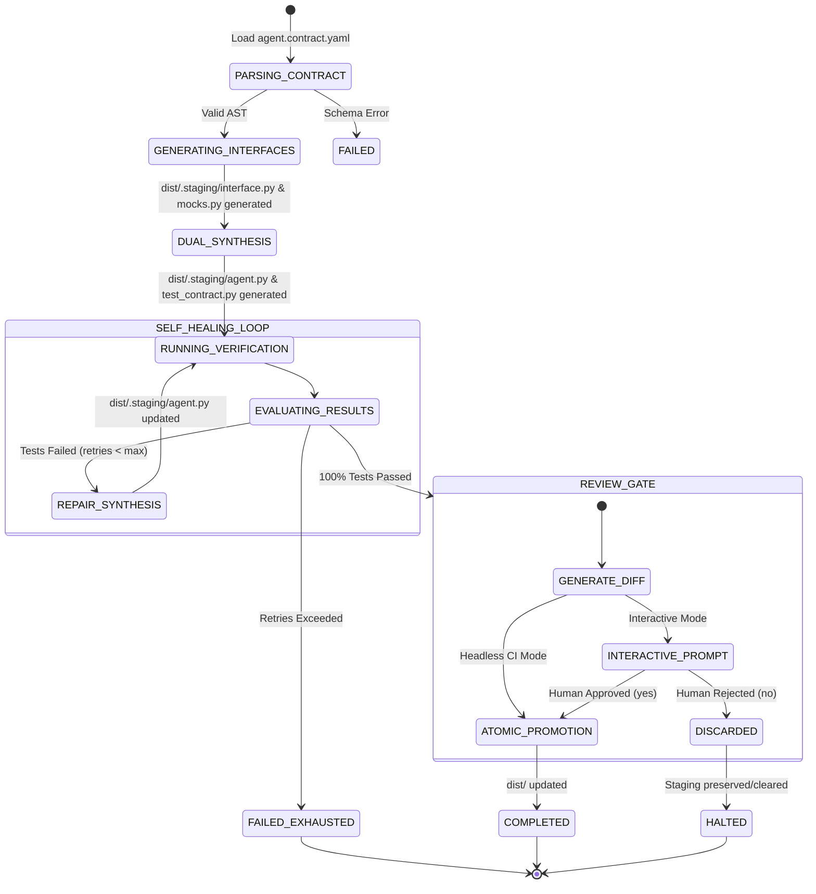

# Data Model: Dual-Synthesis Compiler & Self-Healing Verification Loop

**Feature**: `002-dual-synthesis-compiler`  
**Date**: 2026-09-23  
**Status**: Completed  

---

## 1. Domain Entities & Value Objects

### 1.1 CompilationConfig
Configuration options defining an execution run of the compiler.

| Field | Type | Required | Default | Description |
|---|---|---|---|---|
| `contract_path` | `Path` | Yes | - | Path to the source `agent.contract.yaml` |
| `output_dir` | `Path` | No | `Path("dist")` | Target directory for verified artifacts |
| `staging_dir` | `Path` | No | `Path("dist/.staging")` | Ephemeral build directory for candidate synthesis |
| `provider_name` | `str` | No | `"mock"` | Provider identifier (`"mock"`, `"gemini-flash"`, `"deepseek"`) |
| `model_name` | `str` | No | `None` | Specific model identifier (defaults to provider default) |
| `max_retries` | `int` | No | `3` | Maximum self-healing repair iterations |
| `budget_ceiling` | `float` | No | `0.05` | Maximum allowed compilation cost in USD |
| `per_test_timeout` | `float` | No | `10.0` | Execution timeout in seconds per test |
| `headless_ci` | `bool` | No | `False` | When True, bypasses interactive review gate on 100% pass |

---

### 1.2 LLMResponse & CostTelemetry

#### LLMResponse
Record returned by `LLMProvider.generate()`:

| Field | Type | Description |
|---|---|---|
| `content` | `str` | Raw string or code generated by the model |
| `prompt_tokens` | `int` | Number of input prompt tokens consumed |
| `completion_tokens` | `int` | Number of completion tokens generated |
| `cost_usd` | `float` | Calculated financial cost in USD |
| `model_name` | `str` | Identifier of model that executed the call |

#### CostTelemetry
Session-wide accounting tracking multi-turn financial and token usage:

| Field | Type | Description |
|---|---|---|
| `total_prompt_tokens` | `int` | Cumulative prompt tokens across all synthesis turns |
| `total_completion_tokens` | `int` | Cumulative completion tokens across all turns |
| `total_cost_usd` | `float` | Cumulative financial expenditure in USD |
| `call_count` | `int` | Total number of LLM invocations |
| `by_persona` | `dict[str, float]` | Cost breakdown keyed by persona name |

---

### 1.3 SynthesizerPersona
Persona specification establishing prompt boundaries and task instructions:

| Field | Type | Description |
|---|---|---|
| `name` | `str` | Unique persona identifier (e.g. `"AgentImplementer"`, `"AdversarialTester"`) |
| `system_prompt` | `str` | Role guidelines, formatting rules, and behavioral constraints |
| `temperature` | `float` | Generation temperature (e.g. `0.0` for deterministic code) |

---

### 1.4 VerificationReport & TestFailureDetail

#### TestFailureDetail
Structured diagnostics from a failing test or CEL invariant breach:

| Field | Type | Description |
|---|---|---|
| `test_name` | `str` | Name of failing test function or scenario ID |
| `assertion_error` | `str` | Primary assertion error message |
| `traceback` | `str` | Execution stack trace |
| `cel_invariant_id` | `str \| None` | ID of CEL invariant violated (if triggered) |
| `cel_violation_rule` | `str \| None` | CEL expression rule that failed |
| `cel_args` | `dict[str, Any] \| None` | Arguments passed to tool when invariant failed |

#### VerificationReport
Aggregate outcome from executing tests in the sandboxed runner:

| Field | Type | Description |
|---|---|---|
| `passed` | `bool` | True if and only if all tests and invariant checks passed |
| `total_tests` | `int` | Total number of scenarios/probes executed |
| `passed_tests` | `int` | Count of passing tests |
| `failed_tests` | `int` | Count of failing tests |
| `failures` | `list[TestFailureDetail]` | List of individual test failures and diagnostics |
| `execution_time_seconds` | `float` | Total duration of verification run |
| `raw_output` | `str` | Raw stdout/stderr output from the test runner |

---

### 1.5 SelfHealingSession
Encapsulates state and history for an iterative self-healing repair loop:

| Field | Type | Description |
|---|---|---|
| `job_id` | `str` | UUID for the parent compilation job |
| `iteration` | `int` | Current retry iteration (0 = initial synthesis) |
| `max_retries` | `int` | Maximum repair iterations before halting |
| `candidate_code_history` | `list[str]` | Snapshots of synthesized `agent.py` code per turn |
| `failure_history` | `list[VerificationReport]` | Diagnostic reports for each failing turn |
| `converged` | `bool` | True when candidate satisfies 100% of tests |

---

### 1.6 CompilationResult
Final summary of compiler execution returned to caller or CLI:

| Field | Type | Description |
|---|---|---|
| `success` | `bool` | True if artifacts passed verification and were promoted |
| `promoted` | `bool` | True if artifacts were written to `dist/` |
| `iterations_used` | `int` | Number of self-healing iterations executed |
| `telemetry` | `CostTelemetry` | Token and financial usage report |
| `verification_report` | `VerificationReport` | Final test verification results |
| `generated_files` | `list[Path]` | Paths to generated artifacts (`interface.py`, `mocks.py`, `agent.py`, `test_contract.py`) |
| `diff_summary` | `str \| None` | Text summary of unified diff presented to human gate |

---

## 2. State Machine Diagrams

### 2.1 Compiler Lifecycle State Machine

---

## 3. Storage & Isolation Invariants

1. **Staging Boundary**: All write operations during synthesis and repair loops MUST target `dist/.staging/`.
2. **Atomic Promotion**: Artifacts are copied or renamed into `dist/` only upon passing verification and clearing the review gate.
3. **Protected Path Rule**: Any write attempt targeting `services/`, `.git/`, `src/`, or outside the workspace root triggers an immediate, uncatchable `SecurityError` and aborts compilation.
