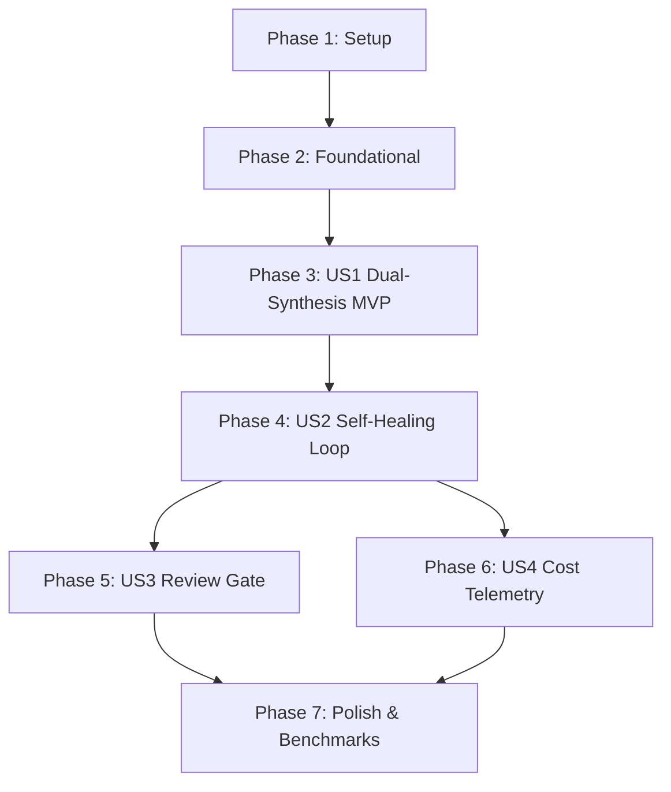

# Tasks: Dual-Synthesis Compiler & Self-Healing Verification Loop

**Feature**: `002-dual-synthesis-compiler`  
**Date**: 2026-09-23  
**Spec**: [specs/002-dual-synthesis-compiler/spec.md](file:///Users/stefano/Documents/contract-agent/specs/002-dual-synthesis-compiler/spec.md)  
**Plan**: [specs/002-dual-synthesis-compiler/plan.md](file:///Users/stefano/Documents/contract-agent/specs/002-dual-synthesis-compiler/plan.md)  

---

## Phase 1: Setup (Shared Infrastructure)

**Purpose**: Project initialization, directory structure, and benchmark contract fixtures.

- [X] T001 Initialize compiler package module exports in `src/contract_agent/compiler/__init__.py`
- [X] T002 [P] Create benchmark contract fixtures (`01_billing_dispute`, `02_sql_read_only_agent`, `03_api_sync_agent`) in `tests/fixtures/benchmarks/`

---

## Phase 2: Foundational (Blocking Prerequisites)

**Purpose**: Core data models, isolation path guards, and mock provider infrastructure that MUST be complete before ANY user story can proceed.

**⚠️ CRITICAL**: No user story work can begin until this phase is complete.

- [X] T003 [P] Implement compiler data models and telemetry schemas (`CompilationConfig`, `LLMResponse`, `CostTelemetry`, `VerificationReport`, `TestFailureDetail`, `CompilationResult`) in `src/contract_agent/compiler/models.py`
- [X] T004 [P] Implement path isolation validator enforcing write containment in `dist/` and forbidding writes to `services/` in `src/contract_agent/compiler/isolation.py`
- [X] T005 [P] Unit tests for path isolation and traversal security in `tests/unit/compiler/test_isolation.py`
- [X] T006 [P] Implement `LLMProvider` protocol, `MockLLMProvider` with fault injection, and provider factory in `src/contract_agent/compiler/providers.py`
- [X] T007 [P] Unit tests for `MockLLMProvider` and provider factory in `tests/unit/compiler/test_providers.py`

**Checkpoint**: Foundation ready — user story implementation can now begin.

---

## Phase 3: User Story 1 - De-Correlated Dual-Synthesis Compilation (Priority: P1) 🎯 MVP

**Goal**: Transform `agent.contract.yaml` into typed protocols (`dist/interface.py`), synthetic mocks (`dist/mocks.py`), FSM agent (`dist/agent.py`), and adversarial tests (`dist/test_contract.py`) using decoupled personas without modifying `services/`.

**Independent Test**: Run dual-synthesis on benchmark contract and verify all four artifacts are generated in `dist/.staging/` strictly conforming to protocols, with 0 modifications to `services/`.

### Implementation for User Story 1

- [X] T008 [P] [US1] Implement deterministic AST code generator for `dist/interface.py` (Protocols) and `dist/mocks.py` in `src/contract_agent/compiler/code_generator.py`
- [X] T009 [P] [US1] Unit tests for deterministic protocol and mock generator in `tests/unit/compiler/test_code_generator.py`
- [X] T010 [P] [US1] Implement decoupled synthesizer personas (`AgentImplementer`, `AdversarialTester`) and prompt templates in `src/contract_agent/compiler/personas.py`
- [X] T011 [US1] Implement dual-synthesis compilation orchestrator generating `dist/.staging/` artifacts in `src/contract_agent/compiler/orchestrator.py`
- [X] T012 [US1] Integration test for dual-synthesis artifact generation in `tests/integration/compiler/test_dual_synthesis.py`

**Checkpoint**: At this point, User Story 1 is fully functional and delivers an independently testable MVP.

---

## Phase 4: User Story 2 - Automated Self-Healing Verification Loop (Priority: P1)

**Goal**: Execute candidate agents against adversarial tests in a sandboxed runner, capture CEL invariant violations, and feed diagnostics into an automated repair loop converging within 3 retries.

**Independent Test**: Compile a contract with an injected candidate defect; assert the verification runner captures the failure trace and CEL violation, prompts repair, and produces a passing agent within retry limits.

### Implementation for User Story 2

- [X] T013 [P] [US2] Implement `SandboxedVerificationRunner` executing `pytest` in an isolated subprocess with 10s per-test timeout in `src/contract_agent/compiler/verification.py`
- [X] T014 [P] [US2] Unit tests for `SandboxedVerificationRunner` and timeout containment in `tests/unit/compiler/test_verification.py`
- [X] T015 [US2] Implement `SelfHealingEngine` managing `SelfHealingSession`, CEL violation diagnostic payloads, and full module repair in `src/contract_agent/compiler/self_healing.py`
- [X] T016 [US2] Integrate `SelfHealingEngine` verification loop into `ContractCompiler.compile()` in `src/contract_agent/compiler/orchestrator.py`
- [X] T017 [US2] Integration test for self-healing repair loop with fault-injected candidate converging in `tests/integration/compiler/test_self_healing_loop.py`

**Checkpoint**: At this point, User Stories 1 AND 2 are functional and self-healing verification operates autonomously.

---

## Phase 5: User Story 3 - Interactive Unified Git Diff Review Gate (Priority: P2)

**Goal**: Intercept candidate promotion with a unified git diff review gate requiring human approval in interactive mode, and providing auto-promotion under `--headless-ci` only upon 100% test pass.

**Independent Test**: Execute compiler in interactive mode and assert execution halts at diff prompt; verify typing "y" promotes to `dist/` and "n" halts without promotion. Verify `--headless-ci` auto-promotes on 100% pass and rejects on failure.

### Implementation for User Story 3

- [X] T018 [P] [US3] Implement `ReviewGate` generating unified git diffs between `dist/` and `dist/.staging/` with atomic promotion in `src/contract_agent/cli/review.py`
- [X] T019 [P] [US3] Unit tests for `ReviewGate` diff generation, interactive confirmation, and atomic promotion in `tests/unit/compiler/test_review_gate.py`
- [X] T020 [US3] Implement `contract-agent compile` CLI command with interactive diff review and `--headless-ci` options in `src/contract_agent/cli/main.py`
- [X] T021 [US3] Integration test for CLI interactive prompts and headless CI auto-promotion in `tests/integration/compiler/test_cli_compile.py`

**Checkpoint**: All candidate promotions are guarded by the review gate per Constitution Principle V.

---

## Phase 6: User Story 4 - Multi-Model Cost & Budget Tracking (Priority: P2)

**Goal**: Track prompt tokens, completion tokens, and dollar expenditures across all compilation turns, enforcing a budget ceiling (< $0.05 per verified compile) and logging telemetry summaries.

**Independent Test**: Run multi-turn synthesis and assert that tokens and dollar costs are calculated accurately per model pricing tables, and compilation aborts gracefully if budget ceiling is exceeded.

### Implementation for User Story 4

- [X] T022 [P] [US4] Implement token counting, pricing calculation, and budget ceiling guard in `src/contract_agent/compiler/telemetry.py`
- [X] T023 [P] [US4] Implement live LLM provider adapters for Gemini Flash and DeepSeek-V3 in `src/contract_agent/compiler/providers.py`
- [X] T024 [P] [US4] Unit tests for cost telemetry, token accounting, and budget ceiling aborts in `tests/unit/compiler/test_telemetry.py`
- [X] T025 [US4] Integrate cost telemetry reporting and budget aborts into `src/contract_agent/compiler/orchestrator.py` and CLI summary display

**Checkpoint**: Cost telemetry and budget discipline are strictly enforced per Constitution Architectural Constraints.

---

## Phase 7: Polish & Cross-Cutting Concerns

**Purpose**: End-to-end benchmark validation, package exports, type checking, and linting.

- [X] T026 [P] Implement end-to-end 3-contract convergence benchmark integration test in `tests/integration/compiler/test_benchmark_convergence.py`
- [X] T027 [P] Export public compiler classes and functions in `src/contract_agent/__init__.py`
- [X] T028 Validate all runnable scenarios in `specs/002-dual-synthesis-compiler/quickstart.md`
- [X] T029 Execute full static type analysis (`pyrefly check`) and linter checks (`ruff check src tests`)

---

## Dependencies & Execution Order

### Phase Dependencies

- **Setup (Phase 1)**: No dependencies — can start immediately.
- **Foundational (Phase 2)**: Depends on Setup completion — BLOCKS all user stories.
- **User Story 1 (Phase 3)**: Depends on Foundational completion. Delivers the core compiler MVP.
- **User Story 2 (Phase 4)**: Depends on US1 completion (needs synthesis pipeline to verify and repair).
- **User Story 3 (Phase 5)**: Depends on US1/US2 completion (promotes verified artifacts from staging).
- **User Story 4 (Phase 6)**: Depends on US1/US2 completion (tracks multi-turn synthesis and self-healing costs).
- **Polish (Phase 7)**: Depends on all user story phases being complete.



---

## Parallel Execution Opportunities

### Phase 1 & 2 Parallel Tasks
```bash
# Foundational tasks with distinct files:
Task: "Implement compiler data models in src/contract_agent/compiler/models.py"
Task: "Implement path isolation validator in src/contract_agent/compiler/isolation.py"
Task: "Implement LLMProvider protocol and MockLLMProvider in src/contract_agent/compiler/providers.py"
```

### Phase 3 (User Story 1) Parallel Tasks
```bash
# US1 components with distinct files:
Task: "Implement deterministic AST code generator in src/contract_agent/compiler/code_generator.py"
Task: "Implement decoupled synthesizer personas in src/contract_agent/compiler/personas.py"
```

### Phase 5 & 6 Parallel Tasks
Once User Story 2 completes, User Story 3 (Review Gate) and User Story 4 (Cost Telemetry) can be executed in parallel.

---

## Implementation Strategy

### MVP First (User Story 1 Only)
1. Complete Phase 1: Setup (fixtures and structure)
2. Complete Phase 2: Foundational (models, path isolation, mock provider)
3. Complete Phase 3: User Story 1 (deterministic AST code gen + dual-synthesis orchestrator)
4. **STOP and VALIDATE**: Verify `dist/.staging/` artifacts are created with 0 service modifications.

### Incremental Delivery
1. Foundation + US1 → Core Dual-Synthesis MVP
2. Add US2 → Autonomous Self-Healing Verification Loop
3. Add US3 → Interactive Git Diff Review Gate & Headless CI
4. Add US4 → Cost Telemetry & Live Multi-Backend Adapters
5. Polish → 3-contract convergence benchmark validation, pyrefly 0 errors, ruff clean.
