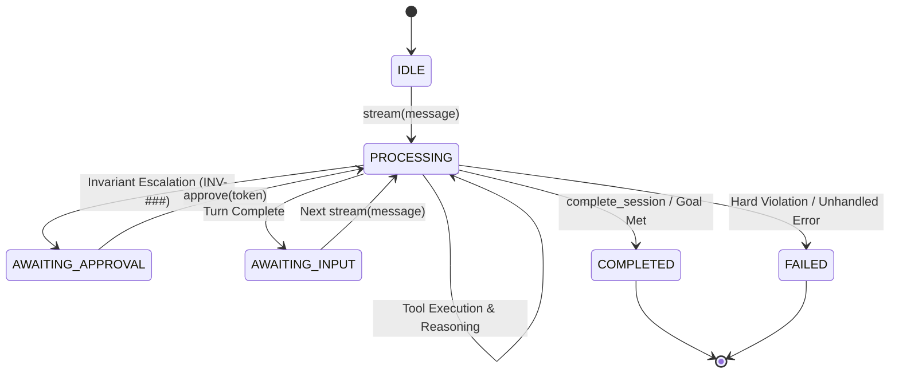

# Data Model: Conversational Agent Template & Interactive Execution

**Feature**: `003-conversational-agent-template`  
**Date**: 2026-09-24  
**Status**: Ready for Implementation  

---

## 1. Entities & Value Objects

### 1.1 `AgentState` (Enum)
Represents the deterministic operational state of the conversational agent.

```python
class AgentState(str, Enum):
    IDLE = "IDLE"
    PROCESSING = "PROCESSING"
    AWAITING_INPUT = "AWAITING_INPUT"
    AWAITING_APPROVAL = "AWAITING_APPROVAL"
    COMPLETED = "COMPLETED"
    FAILED = "FAILED"
```

- **Transitions**:
  - `IDLE` $\to$ `PROCESSING` (on receiving user message in `stream()` / `step()`)
  - `PROCESSING` $\to$ `PROCESSING` (during internal ReAct reasoning and tool iterations)
  - `PROCESSING` $\to$ `AWAITING_INPUT` (turn finished, waiting for next user message)
  - `PROCESSING` $\to$ `AWAITING_APPROVAL` (invariant escalation triggered)
  - `AWAITING_APPROVAL` $\to$ `PROCESSING` (approval granted via `approve()`)
  - `PROCESSING` $\to$ `COMPLETED` (explicit completion signal or scenario fulfilled)
  - `*` $\to$ `FAILED` (unhandled error or hard invariant breach halting session)

---

### 1.2 `ConversationEventType` (Enum)
Types of granular events emitted during an interactive streaming turn.

```python
class ConversationEventType(str, Enum):
    TOKEN = "token"
    THOUGHT = "thought"
    TOOL_CALL_START = "tool_call_start"
    TOOL_CALL_RESULT = "tool_call_result"
    STATE_CHANGE = "state_change"
    ESCALATION_REQUIRED = "escalation_required"
    TURN_COMPLETE = "turn_complete"
    ERROR = "error"
```

---

### 1.3 `ConversationEvent` (Model)
Individual event yielded across the asynchronous `stream()` iterator.

| Field | Type | Description |
| :--- | :--- | :--- |
| `type` | `ConversationEventType` | Event discriminator. |
| `content` | `str \| None` | Textual chunk (token, thought, or explanation). |
| `tool_name` | `str \| None` | Name of tool associated with start/result. |
| `tool_args` | `dict[str, Any] \| None` | Invocation arguments passed to the tool. |
| `tool_result` | `Any \| None` | Return value from tool execution. |
| `new_state` | `AgentState \| None` | Present if event represents a state transition. |
| `approval_token` | `str \| None` | Token issued when escalation is required. |
| `timestamp` | `float` | Unix timestamp of the event. |

---

### 1.4 `MessageRole` (Enum)
Canonical message authorship roles.

```python
class MessageRole(str, Enum):
    SYSTEM = "system"
    USER = "user"
    ASSISTANT = "assistant"
    TOOL = "tool"
```

---

### 1.5 `ConversationMessage` (Model)
Immutable record of an individual communication turn stored in conversation history.

| Field | Type | Description |
| :--- | :--- | :--- |
| `id` | `str` | UUID identifier for message. |
| `role` | `MessageRole` | Message author role. |
| `content` | `str` | Text content of the message. |
| `tool_calls` | `list[dict[str, Any]]` | List of tool calls requested by assistant. |
| `tool_call_id` | `str \| None` | Associated tool call ID when role is `tool`. |
| `timestamp` | `float` | Creation timestamp. |

---

### 1.6 `PendingApproval` (Model)
Represents a tool execution suspended pending human escalation.

| Field | Type | Description |
| :--- | :--- | :--- |
| `token` | `str` | Unique, cryptographically random approval token. |
| `invariant_id` | `str` | Triggered contract invariant ID (e.g. `INV-001`). |
| `tool_name` | `str` | Tool whose execution was intercepted. |
| `tool_args` | `dict[str, Any]` | Bound tool arguments. |
| `created_at` | `float` | Timestamp of escalation. |
| `status` | `str` | Status: `pending`, `approved`, `rejected`. |

---

### 1.7 `ConversationSession` (Model)
Stateful container for an entire multi-turn interaction.

| Field | Type | Description |
| :--- | :--- | :--- |
| `session_id` | `str` | Unique session identifier. |
| `state` | `AgentState` | Current agent state (default `IDLE`). |
| `messages` | `list[ConversationMessage]` | Chronological unbounded message history. |
| `pending_approvals` | `dict[str, PendingApproval]` | Active approvals keyed by token. |
| `metadata` | `dict[str, Any]` | Extensible metadata (user IDs, contract version). |

---

### 1.8 `ConversationTurnResult` (Model)
Structured result returned by the synchronous `step()` facade.

| Field | Type | Description |
| :--- | :--- | :--- |
| `reply` | `str` | Complete aggregated assistant response text. |
| `state` | `AgentState` | State of the agent after turn completion. |
| `events` | `list[ConversationEvent]` | All events emitted during the turn. |
| `tools_executed` | `list[str]` | Names of tools invoked during the turn. |
| `requires_approval` | `bool` | True if turn halted on invariant escalation. |
| `approval_token` | `str \| None` | Active approval token if escalation occurred. |

---

## 2. State Transition Diagram


