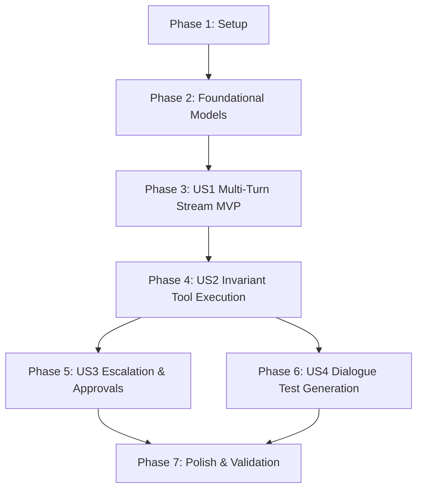

# Tasks: Conversational Agent Template & Interactive Execution

**Feature**: `003-conversational-agent-template`  
**Spec**: [specs/003-conversational-agent-template/spec.md](file:///Users/stefano/Documents/contract-agent/specs/003-conversational-agent-template/spec.md)  
**Plan**: [specs/003-conversational-agent-template/plan.md](file:///Users/stefano/Documents/contract-agent/specs/003-conversational-agent-template/plan.md)  

---

## Phase 1: Setup (Shared Infrastructure)

**Purpose**: Initialize conversational benchmark contracts and module exports.

- [X] T001 [P] Create multi-turn conversational customer service benchmark contract in `tests/fixtures/benchmarks/04_conversational_service.contract.yaml`
- [X] T002 [P] Export conversational data model schemas and event types in `src/contract_agent/compiler/__init__.py`

---

## Phase 2: Foundational (Blocking Prerequisites)

**Purpose**: Core data models, event schemas, and session structures required by all conversational user stories.

**⚠️ CRITICAL**: Must complete before user story implementation begins.

- [X] T003 [P] Implement `AgentState` enum (`IDLE`, `PROCESSING`, `AWAITING_INPUT`, `AWAITING_APPROVAL`, `COMPLETED`, `FAILED`) and `ConversationEventType` enum (`token`, `thought`, `tool_call_start`, `tool_call_result`, `state_change`, `escalation_required`, `turn_complete`, `error`) in `src/contract_agent/compiler/models.py`
- [X] T004 [P] Implement `ConversationEvent`, `MessageRole` (`system`, `user`, `assistant`, `tool`), `ConversationMessage`, `PendingApproval`, `ConversationSession`, and `ConversationTurnResult` Pydantic models in `src/contract_agent/compiler/models.py`
- [X] T005 [P] Unit tests for conversational data models, event schemas, and serialization roundtrips in `tests/unit/compiler/test_conversational_models.py`
- [X] T006 Extend `WorkflowContext` to track conversational session identifiers and metadata in `src/contract_agent/runtime/context.py`

**Checkpoint**: Foundational schemas and test suites verified — User Story 1 implementation can begin.

---

## Phase 3: User Story 1 - Multi-Turn Conversational Interaction (Priority: P1) 🎯 MVP

**Goal**: Synthesize a stream-first conversational agent template with asynchronous streaming (`stream`), synchronous execution facades (`step`, `chat`), unbounded message history, and session state persistence.

**Independent Test**: Instantiate a synthesized conversational agent, send sequential user messages, and verify that the agent maintains context, appends messages to `ConversationSession`, yields typed events, and transitions states across turns.

### Tests for User Story 1

- [X] T007 [P] [US1] Unit tests for conversational agent template code generation in `tests/unit/compiler/test_conversational_templates.py`
- [X] T008 [P] [US1] Integration tests for multi-turn dialogue, message history, and session reset in `tests/integration/compiler/test_conversational_agent.py`

### Implementation for User Story 1

- [X] T009 [US1] Implement stream-first conversational agent class template with `stream()`, `step()`, `chat()`, `reset()`, `export_session()`, and `from_session()` in `src/contract_agent/compiler/templates.py`
- [X] T010 [US1] Update `AgentImplementer` system prompt and prompt builder in `src/contract_agent/compiler/personas.py` to synthesize conversational agent classes
- [X] T011 [US1] Wire conversational agent generation into `ContractCompiler.compile()` in `src/contract_agent/compiler/orchestrator.py`

**Checkpoint**: User Story 1 complete — conversational agents can stream events, retain multi-turn context, and export/restore sessions.

---

## Phase 4: User Story 2 - Invariant-Guarded Conversational Tool Execution (Priority: P1)

**Goal**: Implement a ReAct reasoning loop within the conversational template that invokes declared contract tools, evaluates invariants via `GuardInterceptor`, and translates violations into conversational explanations.

**Independent Test**: Run a conversational session where user prompts trigger tool calls; assert authorized calls execute and appear in turn events, while unauthorized calls are blocked by CEL invariants with error explanations returned conversationally.

### Tests for User Story 2

- [X] T012 [P] [US2] Integration test for conversational tool execution, ReAct loop iteration limits, and CEL violation blocking in `tests/integration/compiler/test_conversational_tools.py`

### Implementation for User Story 2

- [X] T013 [US2] Implement ReAct execution loop in `ConversationalAgent.stream()` dispatching tools through `GuardInterceptor.wrap_tool()` and catching CEL guard outcomes in `src/contract_agent/compiler/templates.py`
- [X] T014 [US2] Add turn iteration limit guard (default 5 iterations) to prevent runaway conversational tool loops in `src/contract_agent/compiler/templates.py`
- [X] T015 [US2] Implement conversational formatting of CEL invariant violation and blocking diagnostics in `src/contract_agent/compiler/templates.py`

**Checkpoint**: User Story 2 complete — agents execute tools conversationally with strict CEL invariant enforcement.

---

## Phase 5: User Story 3 - Conversational Escalation & Approval Workflows (Priority: P2)

**Goal**: Implement hybrid approval handling where invariant escalations transition the agent to `AWAITING_APPROVAL`, emit an approval token, and resume upon programmatic `approve()` or in-band supervisor message.

**Independent Test**: Trigger a conversational turn requiring manager approval; verify the agent halts with `AWAITING_APPROVAL`, provides a token, and resumes tool execution when approved.

### Tests for User Story 3

- [X] T016 [P] [US3] Unit tests for `approve()` validation, token generation, and approval state transitions in `tests/unit/compiler/test_conversational_escalation.py`
- [X] T017 [P] [US3] Integration test for conversational escalation pause and hybrid resumption in `tests/integration/compiler/test_conversational_escalation.py`

### Implementation for User Story 3

- [X] T018 [US3] Implement `PendingApproval` token management and state transition to `AWAITING_APPROVAL` in `src/contract_agent/compiler/templates.py`
- [X] T019 [US3] Implement `ConversationalAgent.approve(token, approver_id)` method and in-band supervisor message detection in `src/contract_agent/compiler/templates.py`

**Checkpoint**: User Story 3 complete — sensitive actions pause for escalation and resume cleanly without session loss.

---

## Phase 6: User Story 4 - Multi-Turn Dialogue Testing & Scenario Simulation (Priority: P2)

**Goal**: Synthesize multi-turn dialogue test suites in `dist/test_contract.py` that validate conversational turns, state transitions, and adversarial probes.

**Independent Test**: Compile a benchmark contract and run pytest against generated `dist/test_contract.py`; assert all dialogue scenario tests pass 100%.

### Tests for User Story 4

- [X] T020 [P] [US4] Integration test verifying compiler synthesizes runnable conversational test suites in `tests/integration/compiler/test_conversational_test_gen.py`

### Implementation for User Story 4

- [X] T021 [US4] Update `generate_default_test_suite()` in `src/contract_agent/compiler/templates.py` to generate multi-turn dialogue test functions simulating contract scenarios
- [X] T022 [US4] Update `AdversarialTester` persona prompt in `src/contract_agent/compiler/personas.py` to synthesize conversational boundary probe tests
- [X] T023 [US4] Implement explicit `complete_session` terminal event handling in test suites in `src/contract_agent/compiler/templates.py`

**Checkpoint**: User Story 4 complete — multi-turn dialogue verification suites evaluate in sandboxed test runs.

---

## Phase 7: Polish & Cross-Cutting Concerns

**Purpose**: End-to-end quickstart validation, static type checks, linter verification, and test suite convergence.

- [X] T024 Validate all 4 quickstart scenarios in `specs/003-conversational-agent-template/quickstart.md`
- [X] T025 [P] Export `ConversationalAgent` and conversational models in root `src/contract_agent/__init__.py`
- [X] T026 Execute full static type analysis (`pyrefly check`) ensuring 0 errors
- [X] T027 Execute linter checks (`ruff check src tests`) ensuring clean status
- [X] T028 Run full test suite (`pytest tests`) verifying 100% pass rate across all unit and integration tests

---

## Dependencies & Execution Order

### Phase Dependencies

- **Setup (Phase 1)**: No dependencies — can start immediately.
- **Foundational (Phase 2)**: Depends on Setup — BLOCKS all user stories.
- **User Story 1 (Phase 3)**: Depends on Foundational completion. Delivers the Core Conversational MVP.
- **User Story 2 (Phase 4)**: Depends on US1 (embeds ReAct loop into conversational template).
- **User Story 3 (Phase 5)**: Depends on US2 (handles escalation during tool execution).
- **User Story 4 (Phase 6)**: Depends on US1/US2/US3 (synthesizes tests for full conversational lifecycle).
- **Polish (Phase 7)**: Depends on all user stories being complete.



---

## Parallel Execution Opportunities

### Phase 1 & 2 Parallel Tasks
```bash
# Foundational tasks with distinct files:
Task: "Implement AgentState and ConversationEventType enums in src/contract_agent/compiler/models.py"
Task: "Implement ConversationEvent and ConversationSession in src/contract_agent/compiler/models.py"
Task: "Extend WorkflowContext in src/contract_agent/runtime/context.py"
Task: "Create conversational benchmark contract in tests/fixtures/benchmarks/04_conversational_service.contract.yaml"
```

### Phase 3 (User Story 1) Parallel Tasks
```bash
# US1 tests and prompt templates:
Task: "Unit tests for conversational templates in tests/unit/compiler/test_conversational_templates.py"
Task: "Update AgentImplementer persona in src/contract_agent/compiler/personas.py"
```

---

## Implementation Strategy

### MVP First (User Story 1 Only)
1. Complete Phase 1: Setup (`04_conversational_service.contract.yaml`).
2. Complete Phase 2: Foundational (Pydantic models, event schemas, `WorkflowContext`).
3. Complete Phase 3: User Story 1 (Stream-first conversational agent template with `stream`, `step`, `chat`).
4. **STOP and VALIDATE**: Verify multi-turn chat interaction independently.

### Incremental Delivery
1. Foundation + US1 $\to$ Core Conversational Agent MVP
2. Add US2 $\to$ ReAct Tool Execution with Deterministic CEL Invariant Enforcement
3. Add US3 $\to$ Hybrid Escalation Pause & Resumption Workflows
4. Add US4 $\to$ Multi-Turn Dialogue Test Generation in `dist/test_contract.py`
5. Polish $\to$ Quickstart verification, Pyrefly 0 errors, Ruff clean, 100% test pass rate.
